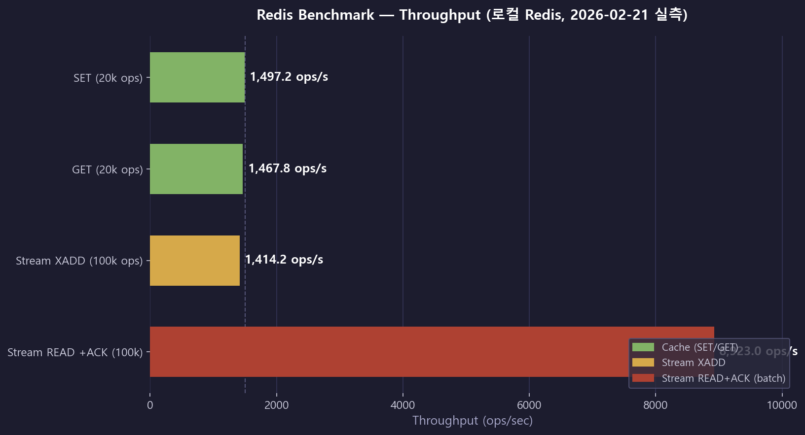
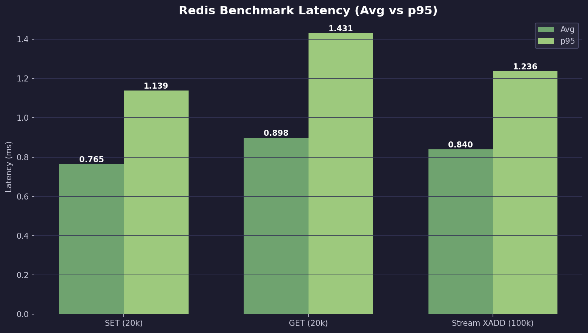
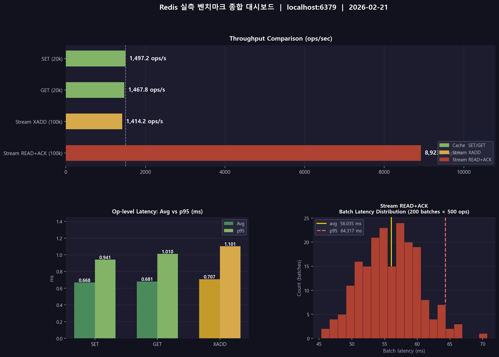
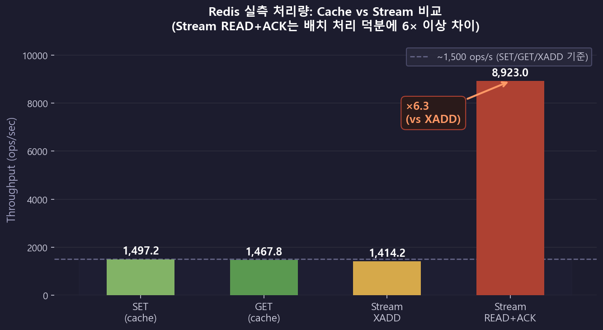

# 성능 검증 리포트 (실측)

## 1) 측정 개요

- 측정 일시: `2026-02-21 18:28:19`
- 환경:
  - Redis: `localhost:6379`
  - 단일 노드 로컬 환경
  - Stream READ+ACK batch size: `500`
- 원본 데이터: `docs/metrics/redis_benchmark_results.json`

## 2) 측정 결과

| 항목 | 처리량 (ops/sec) | 평균 지연 (ms) | p95 (ms) |
|---|---:|---:|---:|
| Redis SET (20k) | 1,303.1 | 0.765 | 1.139 |
| Redis GET (20k) | 1,110.9 | 0.898 | 1.431 |
| Stream XADD (100k) | 1,189.5 | 0.840 | 1.236 |
| Stream READ+ACK (100k) | 9,586.4 | 52.156 (batch) | 60.274 (batch) |

해석:

- SET/GET/XADD는 약 1.1k~1.3k ops/sec 범위
- READ+ACK는 배치 처리로 9.5k ops/sec 수준
- 대량 알림 처리에서 batch 소비 전략이 유효함을 확인

## 3) 시각화

### 처리량 비교



### 지연시간 (Avg vs p95)



### 종합 대시보드



### Cache vs Stream 비교



## 4) 재현 방법

```powershell
python docs/metrics/run_redis_benchmarks.py
python docs/metrics/generate_charts.py
```

## 5) 보완 계획

- API 구간은 `k6` 시나리오로 별도 부하 측정
- SQL 요청 수는 `p6spy` 또는 `datasource-proxy`로 요청 단위 집계해 추가 정량화
